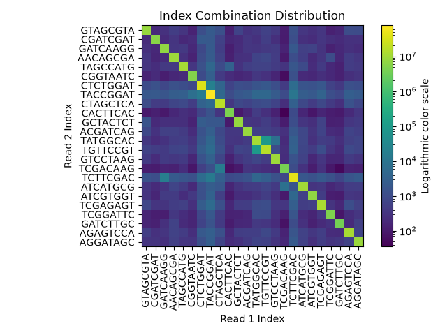

## Summary Log for demultiplexing of files:
    Read 1 biological sequence file: seq_files/1294_S1_L008_R1_001.fastq.gz

    Read 1 index sequence file: seq_files/1294_S1_L008_R2_001.fastq.gz

    Read 2 biological sequence file: seq_files/1294_S1_L008_R4_001.fastq.gz

    Read 2 index sequence file: seq_files/1294_S1_L008_R3_001.fastq.gz

---

### Total number of records: 363246735
    Read-pairs with matched indexes: 331755033, 91.33%

    Read-pairs with hopped indexes: 707740, 0.19%

    Read-pairs with low quality or unknown indexes: 30783962, 8.47%

---

### Heatmap of Index Distributions



---

### Count of each index combination with at least one instance:

#### Matched pairs:
```
GTAGCGTA-GTAGCGTA: 8119243, 2.24%
CGATCGAT-CGATCGAT: 5604966, 1.54%
GATCAAGG-GATCAAGG: 6587100, 1.81%
AACAGCGA-AACAGCGA: 8872034, 2.44%
TAGCCATG-TAGCCATG: 10629633, 2.93%
CGGTAATC-CGGTAATC: 5064906, 1.39%
CTCTGGAT-CTCTGGAT: 34976387, 9.63%
TACCGGAT-TACCGGAT: 76363857, 21.02%
CTAGCTCA-CTAGCTCA: 17332036, 4.77%
CACTTCAC-CACTTCAC: 4191388, 1.15%
GCTACTCT-GCTACTCT: 7416557, 2.04%
ACGATCAG-ACGATCAG: 7942853, 2.19%
TATGGCAC-TATGGCAC: 11184304, 3.08%
TGTTCCGT-TGTTCCGT: 15733007, 4.33%
GTCCTAAG-GTCCTAAG: 8830276, 2.43%
TCGACAAG-TCGACAAG: 3853350, 1.06%
TCTTCGAC-TCTTCGAC: 42094112, 11.59%
ATCATGCG-ATCATGCG: 10087503, 2.78%
ATCGTGGT-ATCGTGGT: 6887592, 1.90%
TCGAGAGT-TCGAGAGT: 11741547, 3.23%
TCGGATTC-TCGGATTC: 4611350, 1.27%
GATCTTGC-GATCTTGC: 3641072, 1.00%
AGAGTCCA-AGAGTCCA: 11316780, 3.12%
AGGATAGC-AGGATAGC: 8673180, 2.39%
```
#### Hopped instances
```
GTAGCGTA-CGATCGAT: 213, 0.00%
GTAGCGTA-GATCAAGG: 258, 0.00%
GTAGCGTA-AACAGCGA: 348, 0.00%
GTAGCGTA-TAGCCATG: 332, 0.00%
GTAGCGTA-CGGTAATC: 149, 0.00%
GTAGCGTA-CTCTGGAT: 965, 0.00%
GTAGCGTA-TACCGGAT: 1975, 0.00%
GTAGCGTA-CTAGCTCA: 1014, 0.00%
GTAGCGTA-CACTTCAC: 101, 0.00%
GTAGCGTA-GCTACTCT: 1532, 0.00%
GTAGCGTA-ACGATCAG: 826, 0.00%
GTAGCGTA-TATGGCAC: 377, 0.00%
GTAGCGTA-TGTTCCGT: 608, 0.00%
GTAGCGTA-GTCCTAAG: 415, 0.00%
GTAGCGTA-TCGACAAG: 119, 0.00%
GTAGCGTA-TCTTCGAC: 1351, 0.00%
GTAGCGTA-ATCATGCG: 353, 0.00%
GTAGCGTA-ATCGTGGT: 306, 0.00%
GTAGCGTA-TCGAGAGT: 776, 0.00%
GTAGCGTA-TCGGATTC: 162, 0.00%
GTAGCGTA-GATCTTGC: 159, 0.00%
GTAGCGTA-AGAGTCCA: 537, 0.00%
GTAGCGTA-AGGATAGC: 327, 0.00%
CGATCGAT-GTAGCGTA: 204, 0.00%
CGATCGAT-GATCAAGG: 183, 0.00%
CGATCGAT-AACAGCGA: 171, 0.00%
CGATCGAT-TAGCCATG: 236, 0.00%
CGATCGAT-CGGTAATC: 214, 0.00%
CGATCGAT-CTCTGGAT: 1304, 0.00%
CGATCGAT-TACCGGAT: 2046, 0.00%
CGATCGAT-CTAGCTCA: 463, 0.00%
CGATCGAT-CACTTCAC: 124, 0.00%
CGATCGAT-GCTACTCT: 195, 0.00%
CGATCGAT-ACGATCAG: 291, 0.00%
CGATCGAT-TATGGCAC: 219, 0.00%
CGATCGAT-TGTTCCGT: 504, 0.00%
CGATCGAT-GTCCTAAG: 227, 0.00%
CGATCGAT-TCGACAAG: 105, 0.00%
CGATCGAT-TCTTCGAC: 1160, 0.00%
CGATCGAT-ATCATGCG: 208, 0.00%
CGATCGAT-ATCGTGGT: 167, 0.00%
CGATCGAT-TCGAGAGT: 329, 0.00%
CGATCGAT-TCGGATTC: 117, 0.00%
CGATCGAT-GATCTTGC: 131, 0.00%
CGATCGAT-AGAGTCCA: 278, 0.00%
CGATCGAT-AGGATAGC: 321, 0.00%
GATCAAGG-GTAGCGTA: 277, 0.00%
GATCAAGG-CGATCGAT: 211, 0.00%
GATCAAGG-AACAGCGA: 215, 0.00%
GATCAAGG-TAGCCATG: 397, 0.00%
GATCAAGG-CGGTAATC: 122, 0.00%
GATCAAGG-CTCTGGAT: 775, 0.00%
GATCAAGG-TACCGGAT: 1650, 0.00%
GATCAAGG-CTAGCTCA: 448, 0.00%
GATCAAGG-CACTTCAC: 95, 0.00%
GATCAAGG-GCTACTCT: 248, 0.00%
GATCAAGG-ACGATCAG: 567, 0.00%
GATCAAGG-TATGGCAC: 297, 0.00%
GATCAAGG-TGTTCCGT: 417, 0.00%
GATCAAGG-GTCCTAAG: 421, 0.00%
GATCAAGG-TCGACAAG: 149, 0.00%
GATCAAGG-TCTTCGAC: 18138, 0.00%
GATCAAGG-ATCATGCG: 323, 0.00%
GATCAAGG-ATCGTGGT: 448, 0.00%
GATCAAGG-TCGAGAGT: 320, 0.00%
GATCAAGG-TCGGATTC: 120, 0.00%
GATCAAGG-GATCTTGC: 266, 0.00%
GATCAAGG-AGAGTCCA: 328, 0.00%
GATCAAGG-AGGATAGC: 264, 0.00%
AACAGCGA-GTAGCGTA: 492, 0.00%
AACAGCGA-CGATCGAT: 329, 0.00%
AACAGCGA-GATCAAGG: 344, 0.00%
AACAGCGA-TAGCCATG: 386, 0.00%
AACAGCGA-CGGTAATC: 173, 0.00%
AACAGCGA-CTCTGGAT: 1292, 0.00%
AACAGCGA-TACCGGAT: 2578, 0.00%
AACAGCGA-CTAGCTCA: 755, 0.00%
AACAGCGA-CACTTCAC: 182, 0.00%
AACAGCGA-GCTACTCT: 249, 0.00%
AACAGCGA-ACGATCAG: 553, 0.00%
AACAGCGA-TATGGCAC: 482, 0.00%
AACAGCGA-TGTTCCGT: 653, 0.00%
AACAGCGA-GTCCTAAG: 363, 0.00%
AACAGCGA-TCGACAAG: 133, 0.00%
AACAGCGA-TCTTCGAC: 2178, 0.00%
AACAGCGA-ATCATGCG: 688, 0.00%
AACAGCGA-ATCGTGGT: 448, 0.00%
AACAGCGA-TCGAGAGT: 508, 0.00%
AACAGCGA-TCGGATTC: 378, 0.00%
AACAGCGA-GATCTTGC: 628, 0.00%
AACAGCGA-AGAGTCCA: 625, 0.00%
AACAGCGA-AGGATAGC: 541, 0.00%
TAGCCATG-GTAGCGTA: 331, 0.00%
TAGCCATG-CGATCGAT: 183, 0.00%
TAGCCATG-GATCAAGG: 398, 0.00%
TAGCCATG-AACAGCGA: 277, 0.00%
TAGCCATG-CGGTAATC: 196, 0.00%
TAGCCATG-CTCTGGAT: 1106, 0.00%
TAGCCATG-TACCGGAT: 2851, 0.00%
TAGCCATG-CTAGCTCA: 877, 0.00%
TAGCCATG-CACTTCAC: 247, 0.00%
TAGCCATG-GCTACTCT: 248, 0.00%
TAGCCATG-ACGATCAG: 441, 0.00%
TAGCCATG-TATGGCAC: 521, 0.00%
TAGCCATG-TGTTCCGT: 724, 0.00%
TAGCCATG-GTCCTAAG: 426, 0.00%
TAGCCATG-TCGACAAG: 231, 0.00%
TAGCCATG-TCTTCGAC: 1611, 0.00%
TAGCCATG-ATCATGCG: 453, 0.00%
TAGCCATG-ATCGTGGT: 239, 0.00%
TAGCCATG-TCGAGAGT: 556, 0.00%
TAGCCATG-TCGGATTC: 240, 0.00%
TAGCCATG-GATCTTGC: 209, 0.00%
TAGCCATG-AGAGTCCA: 466, 0.00%
TAGCCATG-AGGATAGC: 362, 0.00%
CGGTAATC-GTAGCGTA: 148, 0.00%
CGGTAATC-CGATCGAT: 228, 0.00%
CGGTAATC-GATCAAGG: 185, 0.00%
CGGTAATC-AACAGCGA: 154, 0.00%
CGGTAATC-TAGCCATG: 351, 0.00%
CGGTAATC-CTCTGGAT: 766, 0.00%
CGGTAATC-TACCGGAT: 7265, 0.00%
CGGTAATC-CTAGCTCA: 509, 0.00%
CGGTAATC-CACTTCAC: 203, 0.00%
CGGTAATC-GCTACTCT: 147, 0.00%
CGGTAATC-ACGATCAG: 217, 0.00%
CGGTAATC-TATGGCAC: 309, 0.00%
CGGTAATC-TGTTCCGT: 399, 0.00%
CGGTAATC-GTCCTAAG: 164, 0.00%
CGGTAATC-TCGACAAG: 85, 0.00%
CGGTAATC-TCTTCGAC: 1316, 0.00%
CGGTAATC-ATCATGCG: 203, 0.00%
CGGTAATC-ATCGTGGT: 386, 0.00%
CGGTAATC-TCGAGAGT: 258, 0.00%
CGGTAATC-TCGGATTC: 162, 0.00%
CGGTAATC-GATCTTGC: 163, 0.00%
CGGTAATC-AGAGTCCA: 244, 0.00%
CGGTAATC-AGGATAGC: 339, 0.00%
CTCTGGAT-GTAGCGTA: 1165, 0.00%
CTCTGGAT-CGATCGAT: 2171, 0.00%
CTCTGGAT-GATCAAGG: 819, 0.00%
CTCTGGAT-AACAGCGA: 1033, 0.00%
CTCTGGAT-TAGCCATG: 1277, 0.00%
CTCTGGAT-CGGTAATC: 1010, 0.00%
CTCTGGAT-TACCGGAT: 14152, 0.00%
CTCTGGAT-CTAGCTCA: 3445, 0.00%
CTCTGGAT-CACTTCAC: 685, 0.00%
CTCTGGAT-GCTACTCT: 2491, 0.00%
CTCTGGAT-ACGATCAG: 1401, 0.00%
CTCTGGAT-TATGGCAC: 1742, 0.00%
CTCTGGAT-TGTTCCGT: 2652, 0.00%
CTCTGGAT-GTCCTAAG: 1359, 0.00%
CTCTGGAT-TCGACAAG: 570, 0.00%
CTCTGGAT-TCTTCGAC: 6129, 0.00%
CTCTGGAT-ATCATGCG: 1308, 0.00%
CTCTGGAT-ATCGTGGT: 1257, 0.00%
CTCTGGAT-TCGAGAGT: 2379, 0.00%
CTCTGGAT-TCGGATTC: 770, 0.00%
CTCTGGAT-GATCTTGC: 646, 0.00%
CTCTGGAT-AGAGTCCA: 2037, 0.00%
CTCTGGAT-AGGATAGC: 1211, 0.00%
TACCGGAT-GTAGCGTA: 2217, 0.00%
TACCGGAT-CGATCGAT: 2118, 0.00%
TACCGGAT-GATCAAGG: 2203, 0.00%
TACCGGAT-AACAGCGA: 2269, 0.00%
TACCGGAT-TAGCCATG: 4661, 0.00%
TACCGGAT-CGGTAATC: 2913, 0.00%
TACCGGAT-CTCTGGAT: 20269, 0.01%
TACCGGAT-CTAGCTCA: 5282, 0.00%
TACCGGAT-CACTTCAC: 1434, 0.00%
TACCGGAT-GCTACTCT: 1798, 0.00%
TACCGGAT-ACGATCAG: 2928, 0.00%
TACCGGAT-TATGGCAC: 4603, 0.00%
TACCGGAT-TGTTCCGT: 5737, 0.00%
TACCGGAT-GTCCTAAG: 3170, 0.00%
TACCGGAT-TCGACAAG: 1237, 0.00%
TACCGGAT-TCTTCGAC: 13576, 0.00%
TACCGGAT-ATCATGCG: 2665, 0.00%
TACCGGAT-ATCGTGGT: 3453, 0.00%
TACCGGAT-TCGAGAGT: 5863, 0.00%
TACCGGAT-TCGGATTC: 1922, 0.00%
TACCGGAT-GATCTTGC: 1427, 0.00%
TACCGGAT-AGAGTCCA: 2906, 0.00%
TACCGGAT-AGGATAGC: 2734, 0.00%
CTAGCTCA-GTAGCGTA: 1242, 0.00%
CTAGCTCA-CGATCGAT: 599, 0.00%
CTAGCTCA-GATCAAGG: 511, 0.00%
CTAGCTCA-AACAGCGA: 620, 0.00%
CTAGCTCA-TAGCCATG: 977, 0.00%
CTAGCTCA-CGGTAATC: 430, 0.00%
CTAGCTCA-CTCTGGAT: 3996, 0.00%
CTAGCTCA-TACCGGAT: 4738, 0.00%
CTAGCTCA-CACTTCAC: 338, 0.00%
CTAGCTCA-GCTACTCT: 1829, 0.00%
CTAGCTCA-ACGATCAG: 851, 0.00%
CTAGCTCA-TATGGCAC: 977, 0.00%
CTAGCTCA-TGTTCCGT: 1247, 0.00%
CTAGCTCA-GTCCTAAG: 736, 0.00%
CTAGCTCA-TCGACAAG: 14841, 0.00%
CTAGCTCA-TCTTCGAC: 2907, 0.00%
CTAGCTCA-ATCATGCG: 1851, 0.00%
CTAGCTCA-ATCGTGGT: 554, 0.00%
CTAGCTCA-TCGAGAGT: 1256, 0.00%
CTAGCTCA-TCGGATTC: 431, 0.00%
CTAGCTCA-GATCTTGC: 422, 0.00%
CTAGCTCA-AGAGTCCA: 1253, 0.00%
CTAGCTCA-AGGATAGC: 704, 0.00%
CACTTCAC-GTAGCGTA: 131, 0.00%
CACTTCAC-CGATCGAT: 174, 0.00%
CACTTCAC-GATCAAGG: 122, 0.00%
CACTTCAC-AACAGCGA: 125, 0.00%
CACTTCAC-TAGCCATG: 3205, 0.00%
CACTTCAC-CGGTAATC: 224, 0.00%
CACTTCAC-CTCTGGAT: 660, 0.00%
CACTTCAC-TACCGGAT: 1043, 0.00%
CACTTCAC-CTAGCTCA: 371, 0.00%
CACTTCAC-GCTACTCT: 101, 0.00%
CACTTCAC-ACGATCAG: 371, 0.00%
CACTTCAC-TATGGCAC: 358, 0.00%
CACTTCAC-TGTTCCGT: 279, 0.00%
CACTTCAC-GTCCTAAG: 132, 0.00%
CACTTCAC-TCGACAAG: 67, 0.00%
CACTTCAC-TCTTCGAC: 938, 0.00%
CACTTCAC-ATCATGCG: 158, 0.00%
CACTTCAC-ATCGTGGT: 103, 0.00%
CACTTCAC-TCGAGAGT: 179, 0.00%
CACTTCAC-TCGGATTC: 141, 0.00%
CACTTCAC-GATCTTGC: 108, 0.00%
CACTTCAC-AGAGTCCA: 191, 0.00%
CACTTCAC-AGGATAGC: 223, 0.00%
GCTACTCT-GTAGCGTA: 651, 0.00%
GCTACTCT-CGATCGAT: 214, 0.00%
GCTACTCT-GATCAAGG: 229, 0.00%
GCTACTCT-AACAGCGA: 259, 0.00%
GCTACTCT-TAGCCATG: 299, 0.00%
GCTACTCT-CGGTAATC: 166, 0.00%
GCTACTCT-CTCTGGAT: 1195, 0.00%
GCTACTCT-TACCGGAT: 1846, 0.00%
GCTACTCT-CTAGCTCA: 814, 0.00%
GCTACTCT-CACTTCAC: 96, 0.00%
GCTACTCT-ACGATCAG: 370, 0.00%
GCTACTCT-TATGGCAC: 335, 0.00%
GCTACTCT-TGTTCCGT: 709, 0.00%
GCTACTCT-GTCCTAAG: 334, 0.00%
GCTACTCT-TCGACAAG: 99, 0.00%
GCTACTCT-TCTTCGAC: 1122, 0.00%
GCTACTCT-ATCATGCG: 323, 0.00%
GCTACTCT-ATCGTGGT: 240, 0.00%
GCTACTCT-TCGAGAGT: 470, 0.00%
GCTACTCT-TCGGATTC: 148, 0.00%
GCTACTCT-GATCTTGC: 181, 0.00%
GCTACTCT-AGAGTCCA: 492, 0.00%
GCTACTCT-AGGATAGC: 277, 0.00%
ACGATCAG-GTAGCGTA: 292, 0.00%
ACGATCAG-CGATCGAT: 361, 0.00%
ACGATCAG-GATCAAGG: 361, 0.00%
ACGATCAG-AACAGCGA: 275, 0.00%
ACGATCAG-TAGCCATG: 515, 0.00%
ACGATCAG-CGGTAATC: 203, 0.00%
ACGATCAG-CTCTGGAT: 1060, 0.00%
ACGATCAG-TACCGGAT: 2271, 0.00%
ACGATCAG-CTAGCTCA: 665, 0.00%
ACGATCAG-CACTTCAC: 186, 0.00%
ACGATCAG-GCTACTCT: 335, 0.00%
ACGATCAG-TATGGCAC: 454, 0.00%
ACGATCAG-TGTTCCGT: 579, 0.00%
ACGATCAG-GTCCTAAG: 508, 0.00%
ACGATCAG-TCGACAAG: 334, 0.00%
ACGATCAG-TCTTCGAC: 1352, 0.00%
ACGATCAG-ATCATGCG: 433, 0.00%
ACGATCAG-ATCGTGGT: 242, 0.00%
ACGATCAG-TCGAGAGT: 510, 0.00%
ACGATCAG-TCGGATTC: 175, 0.00%
ACGATCAG-GATCTTGC: 193, 0.00%
ACGATCAG-AGAGTCCA: 511, 0.00%
ACGATCAG-AGGATAGC: 415, 0.00%
TATGGCAC-GTAGCGTA: 363, 0.00%
TATGGCAC-CGATCGAT: 275, 0.00%
TATGGCAC-GATCAAGG: 338, 0.00%
TATGGCAC-AACAGCGA: 661, 0.00%
TATGGCAC-TAGCCATG: 610, 0.00%
TATGGCAC-CGGTAATC: 366, 0.00%
TATGGCAC-CTCTGGAT: 1574, 0.00%
TATGGCAC-TACCGGAT: 4625, 0.00%
TATGGCAC-CTAGCTCA: 906, 0.00%
TATGGCAC-CACTTCAC: 474, 0.00%
TATGGCAC-GCTACTCT: 317, 0.00%
TATGGCAC-ACGATCAG: 574, 0.00%
TATGGCAC-TGTTCCGT: 88571, 0.02%
TATGGCAC-GTCCTAAG: 759, 0.00%
TATGGCAC-TCGACAAG: 277, 0.00%
TATGGCAC-TCTTCGAC: 4277, 0.00%
TATGGCAC-ATCATGCG: 472, 0.00%
TATGGCAC-ATCGTGGT: 318, 0.00%
TATGGCAC-TCGAGAGT: 958, 0.00%
TATGGCAC-TCGGATTC: 991, 0.00%
TATGGCAC-GATCTTGC: 404, 0.00%
TATGGCAC-AGAGTCCA: 534, 0.00%
TATGGCAC-AGGATAGC: 675, 0.00%
TGTTCCGT-GTAGCGTA: 575, 0.00%
TGTTCCGT-CGATCGAT: 527, 0.00%
TGTTCCGT-GATCAAGG: 400, 0.00%
TGTTCCGT-AACAGCGA: 791, 0.00%
TGTTCCGT-TAGCCATG: 633, 0.00%
TGTTCCGT-CGGTAATC: 283, 0.00%
TGTTCCGT-CTCTGGAT: 1941, 0.00%
TGTTCCGT-TACCGGAT: 4606, 0.00%
TGTTCCGT-CTAGCTCA: 1116, 0.00%
TGTTCCGT-CACTTCAC: 266, 0.00%
TGTTCCGT-GCTACTCT: 487, 0.00%
TGTTCCGT-ACGATCAG: 568, 0.00%
TGTTCCGT-TATGGCAC: 85536, 0.02%
TGTTCCGT-GTCCTAAG: 462, 0.00%
TGTTCCGT-TCGACAAG: 242, 0.00%
TGTTCCGT-TCTTCGAC: 2719, 0.00%
TGTTCCGT-ATCATGCG: 718, 0.00%
TGTTCCGT-ATCGTGGT: 499, 0.00%
TGTTCCGT-TCGAGAGT: 1090, 0.00%
TGTTCCGT-TCGGATTC: 920, 0.00%
TGTTCCGT-GATCTTGC: 350, 0.00%
TGTTCCGT-AGAGTCCA: 845, 0.00%
TGTTCCGT-AGGATAGC: 584, 0.00%
GTCCTAAG-GTAGCGTA: 385, 0.00%
GTCCTAAG-CGATCGAT: 251, 0.00%
GTCCTAAG-GATCAAGG: 437, 0.00%
GTCCTAAG-AACAGCGA: 461, 0.00%
GTCCTAAG-TAGCCATG: 451, 0.00%
GTCCTAAG-CGGTAATC: 158, 0.00%
GTCCTAAG-CTCTGGAT: 1151, 0.00%
GTCCTAAG-TACCGGAT: 2326, 0.00%
GTCCTAAG-CTAGCTCA: 664, 0.00%
GTCCTAAG-CACTTCAC: 134, 0.00%
GTCCTAAG-GCTACTCT: 277, 0.00%
GTCCTAAG-ACGATCAG: 451, 0.00%
GTCCTAAG-TATGGCAC: 7066, 0.00%
GTCCTAAG-TGTTCCGT: 990, 0.00%
GTCCTAAG-TCGACAAG: 183, 0.00%
GTCCTAAG-TCTTCGAC: 1345, 0.00%
GTCCTAAG-ATCATGCG: 419, 0.00%
GTCCTAAG-ATCGTGGT: 255, 0.00%
GTCCTAAG-TCGAGAGT: 381, 0.00%
GTCCTAAG-TCGGATTC: 271, 0.00%
GTCCTAAG-GATCTTGC: 224, 0.00%
GTCCTAAG-AGAGTCCA: 409, 0.00%
GTCCTAAG-AGGATAGC: 311, 0.00%
TCGACAAG-GTAGCGTA: 110, 0.00%
TCGACAAG-CGATCGAT: 105, 0.00%
TCGACAAG-GATCAAGG: 146, 0.00%
TCGACAAG-AACAGCGA: 100, 0.00%
TCGACAAG-TAGCCATG: 323, 0.00%
TCGACAAG-CGGTAATC: 56, 0.00%
TCGACAAG-CTCTGGAT: 449, 0.00%
TCGACAAG-TACCGGAT: 957, 0.00%
TCGACAAG-CTAGCTCA: 256, 0.00%
TCGACAAG-CACTTCAC: 35, 0.00%
TCGACAAG-GCTACTCT: 105, 0.00%
TCGACAAG-ACGATCAG: 281, 0.00%
TCGACAAG-TATGGCAC: 205, 0.00%
TCGACAAG-TGTTCCGT: 246, 0.00%
TCGACAAG-GTCCTAAG: 233, 0.00%
TCGACAAG-TCTTCGAC: 782, 0.00%
TCGACAAG-ATCATGCG: 7836, 0.00%
TCGACAAG-ATCGTGGT: 98, 0.00%
TCGACAAG-TCGAGAGT: 358, 0.00%
TCGACAAG-TCGGATTC: 127, 0.00%
TCGACAAG-GATCTTGC: 70, 0.00%
TCGACAAG-AGAGTCCA: 150, 0.00%
TCGACAAG-AGGATAGC: 175, 0.00%
TCTTCGAC-GTAGCGTA: 1326, 0.00%
TCTTCGAC-CGATCGAT: 1187, 0.00%
TCTTCGAC-GATCAAGG: 1934, 0.00%
TCTTCGAC-AACAGCGA: 1079, 0.00%
TCTTCGAC-TAGCCATG: 1719, 0.00%
TCTTCGAC-CGGTAATC: 1234, 0.00%
TCTTCGAC-CTCTGGAT: 5933, 0.00%
TCTTCGAC-TACCGGAT: 10986, 0.00%
TCTTCGAC-CTAGCTCA: 3013, 0.00%
TCTTCGAC-CACTTCAC: 951, 0.00%
TCTTCGAC-GCTACTCT: 1090, 0.00%
TCTTCGAC-ACGATCAG: 1807, 0.00%
TCTTCGAC-TATGGCAC: 2865, 0.00%
TCTTCGAC-TGTTCCGT: 3200, 0.00%
TCTTCGAC-GTCCTAAG: 1381, 0.00%
TCTTCGAC-TCGACAAG: 1053, 0.00%
TCTTCGAC-ATCATGCG: 1520, 0.00%
TCTTCGAC-ATCGTGGT: 4468, 0.00%
TCTTCGAC-TCGAGAGT: 2779, 0.00%
TCTTCGAC-TCGGATTC: 1643, 0.00%
TCTTCGAC-GATCTTGC: 1042, 0.00%
TCTTCGAC-AGAGTCCA: 1619, 0.00%
TCTTCGAC-AGGATAGC: 2140, 0.00%
ATCATGCG-GTAGCGTA: 358, 0.00%
ATCATGCG-CGATCGAT: 265, 0.00%
ATCATGCG-GATCAAGG: 549, 0.00%
ATCATGCG-AACAGCGA: 540, 0.00%
ATCATGCG-TAGCCATG: 917, 0.00%
ATCATGCG-CGGTAATC: 201, 0.00%
ATCATGCG-CTCTGGAT: 1513, 0.00%
ATCATGCG-TACCGGAT: 2521, 0.00%
ATCATGCG-CTAGCTCA: 848, 0.00%
ATCATGCG-CACTTCAC: 170, 0.00%
ATCATGCG-GCTACTCT: 328, 0.00%
ATCATGCG-ACGATCAG: 782, 0.00%
ATCATGCG-TATGGCAC: 788, 0.00%
ATCATGCG-TGTTCCGT: 734, 0.00%
ATCATGCG-GTCCTAAG: 636, 0.00%
ATCATGCG-TCGACAAG: 305, 0.00%
ATCATGCG-TCTTCGAC: 1858, 0.00%
ATCATGCG-ATCGTGGT: 598, 0.00%
ATCATGCG-TCGAGAGT: 497, 0.00%
ATCATGCG-TCGGATTC: 217, 0.00%
ATCATGCG-GATCTTGC: 288, 0.00%
ATCATGCG-AGAGTCCA: 621, 0.00%
ATCATGCG-AGGATAGC: 582, 0.00%
ATCGTGGT-GTAGCGTA: 258, 0.00%
ATCGTGGT-CGATCGAT: 219, 0.00%
ATCGTGGT-GATCAAGG: 617, 0.00%
ATCGTGGT-AACAGCGA: 195, 0.00%
ATCGTGGT-TAGCCATG: 228, 0.00%
ATCGTGGT-CGGTAATC: 175, 0.00%
ATCGTGGT-CTCTGGAT: 1349, 0.00%
ATCGTGGT-TACCGGAT: 2090, 0.00%
ATCGTGGT-CTAGCTCA: 472, 0.00%
ATCGTGGT-CACTTCAC: 84, 0.00%
ATCGTGGT-GCTACTCT: 253, 0.00%
ATCGTGGT-ACGATCAG: 307, 0.00%
ATCGTGGT-TATGGCAC: 288, 0.00%
ATCGTGGT-TGTTCCGT: 473, 0.00%
ATCGTGGT-GTCCTAAG: 178, 0.00%
ATCGTGGT-TCGACAAG: 112, 0.00%
ATCGTGGT-TCTTCGAC: 1391, 0.00%
ATCGTGGT-ATCATGCG: 314, 0.00%
ATCGTGGT-TCGAGAGT: 562, 0.00%
ATCGTGGT-TCGGATTC: 157, 0.00%
ATCGTGGT-GATCTTGC: 137, 0.00%
ATCGTGGT-AGAGTCCA: 372, 0.00%
ATCGTGGT-AGGATAGC: 267, 0.00%
TCGAGAGT-GTAGCGTA: 360, 0.00%
TCGAGAGT-CGATCGAT: 349, 0.00%
TCGAGAGT-GATCAAGG: 315, 0.00%
TCGAGAGT-AACAGCGA: 329, 0.00%
TCGAGAGT-TAGCCATG: 428, 0.00%
TCGAGAGT-CGGTAATC: 253, 0.00%
TCGAGAGT-CTCTGGAT: 1857, 0.00%
TCGAGAGT-TACCGGAT: 3632, 0.00%
TCGAGAGT-CTAGCTCA: 829, 0.00%
TCGAGAGT-CACTTCAC: 159, 0.00%
TCGAGAGT-GCTACTCT: 637, 0.00%
TCGAGAGT-ACGATCAG: 655, 0.00%
TCGAGAGT-TATGGCAC: 483, 0.00%
TCGAGAGT-TGTTCCGT: 1126, 0.00%
TCGAGAGT-GTCCTAAG: 362, 0.00%
TCGAGAGT-TCGACAAG: 277, 0.00%
TCGAGAGT-TCTTCGAC: 2011, 0.00%
TCGAGAGT-ATCATGCG: 374, 0.00%
TCGAGAGT-ATCGTGGT: 509, 0.00%
TCGAGAGT-TCGGATTC: 383, 0.00%
TCGAGAGT-GATCTTGC: 215, 0.00%
TCGAGAGT-AGAGTCCA: 516, 0.00%
TCGAGAGT-AGGATAGC: 494, 0.00%
TCGGATTC-GTAGCGTA: 133, 0.00%
TCGGATTC-CGATCGAT: 254, 0.00%
TCGGATTC-GATCAAGG: 132, 0.00%
TCGGATTC-AACAGCGA: 1047, 0.00%
TCGGATTC-TAGCCATG: 191, 0.00%
TCGGATTC-CGGTAATC: 188, 0.00%
TCGGATTC-CTCTGGAT: 619, 0.00%
TCGGATTC-TACCGGAT: 1173, 0.00%
TCGGATTC-CTAGCTCA: 407, 0.00%
TCGGATTC-CACTTCAC: 111, 0.00%
TCGGATTC-GCTACTCT: 123, 0.00%
TCGGATTC-ACGATCAG: 216, 0.00%
TCGGATTC-TATGGCAC: 424, 0.00%
TCGGATTC-TGTTCCGT: 327, 0.00%
TCGGATTC-GTCCTAAG: 164, 0.00%
TCGGATTC-TCGACAAG: 88, 0.00%
TCGGATTC-TCTTCGAC: 1307, 0.00%
TCGGATTC-ATCATGCG: 173, 0.00%
TCGGATTC-ATCGTGGT: 118, 0.00%
TCGGATTC-TCGAGAGT: 311, 0.00%
TCGGATTC-GATCTTGC: 293, 0.00%
TCGGATTC-AGAGTCCA: 223, 0.00%
TCGGATTC-AGGATAGC: 315, 0.00%
GATCTTGC-GTAGCGTA: 170, 0.00%
GATCTTGC-CGATCGAT: 205, 0.00%
GATCTTGC-GATCAAGG: 184, 0.00%
GATCTTGC-AACAGCGA: 179, 0.00%
GATCTTGC-TAGCCATG: 136, 0.00%
GATCTTGC-CGGTAATC: 133, 0.00%
GATCTTGC-CTCTGGAT: 397, 0.00%
GATCTTGC-TACCGGAT: 790, 0.00%
GATCTTGC-CTAGCTCA: 269, 0.00%
GATCTTGC-CACTTCAC: 102, 0.00%
GATCTTGC-GCTACTCT: 132, 0.00%
GATCTTGC-ACGATCAG: 193, 0.00%
GATCTTGC-TATGGCAC: 251, 0.00%
GATCTTGC-TGTTCCGT: 203, 0.00%
GATCTTGC-GTCCTAAG: 167, 0.00%
GATCTTGC-TCGACAAG: 48, 0.00%
GATCTTGC-TCTTCGAC: 755, 0.00%
GATCTTGC-ATCATGCG: 252, 0.00%
GATCTTGC-ATCGTGGT: 109, 0.00%
GATCTTGC-TCGAGAGT: 176, 0.00%
GATCTTGC-TCGGATTC: 85, 0.00%
GATCTTGC-AGAGTCCA: 208, 0.00%
GATCTTGC-AGGATAGC: 368, 0.00%
AGAGTCCA-GTAGCGTA: 1058, 0.00%
AGAGTCCA-CGATCGAT: 285, 0.00%
AGAGTCCA-GATCAAGG: 270, 0.00%
AGAGTCCA-AACAGCGA: 481, 0.00%
AGAGTCCA-TAGCCATG: 459, 0.00%
AGAGTCCA-CGGTAATC: 244, 0.00%
AGAGTCCA-CTCTGGAT: 1255, 0.00%
AGAGTCCA-TACCGGAT: 2707, 0.00%
AGAGTCCA-CTAGCTCA: 1359, 0.00%
AGAGTCCA-CACTTCAC: 197, 0.00%
AGAGTCCA-GCTACTCT: 362, 0.00%
AGAGTCCA-ACGATCAG: 660, 0.00%
AGAGTCCA-TATGGCAC: 551, 0.00%
AGAGTCCA-TGTTCCGT: 889, 0.00%
AGAGTCCA-GTCCTAAG: 407, 0.00%
AGAGTCCA-TCGACAAG: 153, 0.00%
AGAGTCCA-TCTTCGAC: 1660, 0.00%
AGAGTCCA-ATCATGCG: 478, 0.00%
AGAGTCCA-ATCGTGGT: 357, 0.00%
AGAGTCCA-TCGAGAGT: 1115, 0.00%
AGAGTCCA-TCGGATTC: 236, 0.00%
AGAGTCCA-GATCTTGC: 206, 0.00%
AGAGTCCA-AGGATAGC: 606, 0.00%
AGGATAGC-GTAGCGTA: 996, 0.00%
AGGATAGC-CGATCGAT: 282, 0.00%
AGGATAGC-GATCAAGG: 228, 0.00%
AGGATAGC-AACAGCGA: 355, 0.00%
AGGATAGC-TAGCCATG: 394, 0.00%
AGGATAGC-CGGTAATC: 323, 0.00%
AGGATAGC-CTCTGGAT: 1100, 0.00%
AGGATAGC-TACCGGAT: 2227, 0.00%
AGGATAGC-CTAGCTCA: 783, 0.00%
AGGATAGC-CACTTCAC: 359, 0.00%
AGGATAGC-GCTACTCT: 413, 0.00%
AGGATAGC-ACGATCAG: 531, 0.00%
AGGATAGC-TATGGCAC: 683, 0.00%
AGGATAGC-TGTTCCGT: 698, 0.00%
AGGATAGC-GTCCTAAG: 307, 0.00%
AGGATAGC-TCGACAAG: 133, 0.00%
AGGATAGC-TCTTCGAC: 2149, 0.00%
AGGATAGC-ATCATGCG: 509, 0.00%
AGGATAGC-ATCGTGGT: 319, 0.00%
AGGATAGC-TCGAGAGT: 570, 0.00%
AGGATAGC-TCGGATTC: 355, 0.00%
AGGATAGC-GATCTTGC: 549, 0.00%
AGGATAGC-AGAGTCCA: 662, 0.00%
```